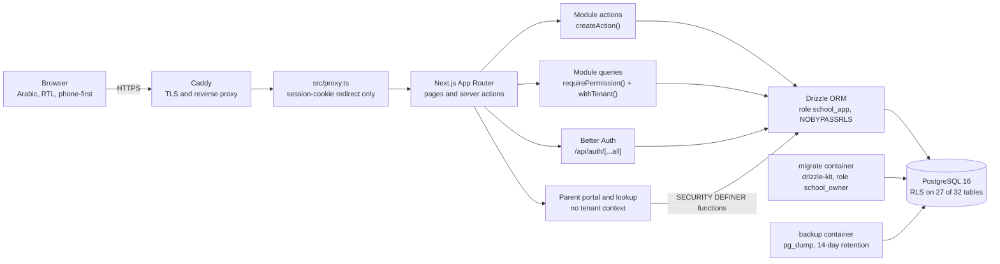
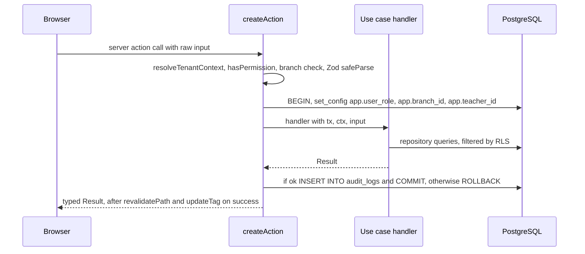

# Architecture

How the system is built and where each part lives. It complements [ADR 0001](decisions/0001-row-level-tenancy.md),
which records _why_ tenancy is row-level with PostgreSQL Row Level Security (RLS); this document describes how
that decision is implemented.

## 1. Overview

The system runs a tutoring centre with several branches: classes, weekly timetables, daily attendance,
assessments, monthly fees, teacher payroll, printable reports, a teacher portal, and a parent portal with a
public lookup page. The interface is Arabic, right-to-left and built for phones first. It is one Next.js
application (App Router, server components, server actions), organised as a modular monolith over PostgreSQL 16
through Drizzle ORM. Branch isolation is enforced twice: in the application, by a `TenantContext` that every
repository function requires, and in the database, by RLS policies that the application's role cannot bypass.

## 2. System diagram



`src/app/` holds routes only. Reads are server components and writes are server actions; the only HTTP route
handlers are `src/app/api/auth/[...all]` and `src/app/api/health`. `src/proxy.ts` only redirects requests that
lack a session cookie. The schema is in `src/shared/db/schema/` and the 23 migrations are in `drizzle/`.

## 3. Modular monolith

Business code lives in `src/modules/<module>/`, split into `domain/` (pure TypeScript), `application/` (use
cases, queries, Zod schemas), `infrastructure/` (Drizzle repositories) and `ui/`, behind a public `index.ts`.
Cross-cutting code is in `src/shared/`. There are 16 modules:

| Module        | Role                                                                               |
| ------------- | ---------------------------------------------------------------------------------- |
| `assessments` | Quizzes and exams, per-student marks, publishing marks to parents                  |
| `attendance`  | Class sessions as they happened (incl. substitutes, extra sessions) and attendance |
| `audit`       | Read side of `audit_logs`; writes happen inside `createAction`                     |
| `branches`    | Branch records and the super admin's branch switcher                               |
| `classes`     | Classes (student groups) within a branch                                           |
| `fees`        | Fee plans, monthly invoices, payments, reversals, receipts, exports                |
| `lookup`      | Session-less public lookup by student code and phone digits, with rate limiting    |
| `payroll`     | Teacher earnings from completed sessions, monthly settlements, exports             |
| `portal`      | Parent portal: sign-in, sessions, children's attendance, balance, grades, opt-out  |
| `reports`     | Attendance, absence and money reports; parent contact lists and messaging opt-outs |
| `settings`    | Centre identity, logo, feature switches, academic terms                            |
| `students`    | Students, enrolment history, class changes, archive/restore, branch transfer       |
| `subjects`    | Global subject list                                                                |
| `teachers`    | Teacher profiles, pay rates, branch links, portal access codes                     |
| `timetable`   | Per-branch bell schedules, weekly slots, conflict checks, copying a week           |
| `users`       | Branch-admin accounts                                                              |

Boundaries are enforced by ESLint's built-in `no-restricted-imports` rule in `eslint.config.mjs`, as errors,
with `--max-warnings=0` in CI and in the pre-commit hook (`.husky/pre-commit`):

```js
// eslint.config.mjs (messages trimmed)
const CROSS_MODULE_DEEP_IMPORT = { group: ["@/modules/*/*", "@/modules/*/*/**"], message: "…" };
const DOMAIN_MUST_STAY_PURE = [
  { group: ["next", "next/*", "react", "react-dom", "react/*", "drizzle-orm", "drizzle-orm/*", "postgres"] },
  { group: ["@/shared/db", "@/shared/db/**"] },
];
// src/**/*.{ts,tsx}:            patterns: [CROSS_MODULE_DEEP_IMPORT]
// src/modules/*/domain/**/*.ts: patterns: [CROSS_MODULE_DEEP_IMPORT, ...DOMAIN_MUST_STAY_PURE]
```

So `@/modules/students` may be imported from anywhere, `@/modules/students/domain/x` may not, and a `domain/`
file cannot import a framework, the ORM or the database client.

## 4. The mutation pipeline

Every staff mutation is declared with `createAction` (`src/shared/actions/create-action.ts`): 52 declarations
across 18 use-case files. The function it returns runs these stages in order and stops at the first failure:

1. **Authenticate and resolve the tenant.** `resolveTenantContext()` (`src/shared/auth/session.ts`) reads the
   Better Auth session; the branch comes from the user row (branch admin) or a validated cookie (super admin).
   Fails with `UNAUTHORIZED`.
2. **Permission.** `hasPermission(ctx.role, options.permission)`. Fails with `FORBIDDEN`.
3. **Branch required.** Unless `requireBranch: false`, a non-teacher with no branch fails with `BRANCH_REQUIRED`.
4. **Validation.** `options.schema.safeParse(raw)` with Zod. Fails with `VALIDATION_ERROR` and per-field errors.
5. **Tenant transaction.** `withTenant(ctx, …)` opens a transaction and sets the RLS variables (section 5).
6. **Use case.** `handler({ tx, ctx, input })` returns a `Result<T>` (`src/shared/lib/result.ts`).
7. **Audit.** On success, `writeAuditLog` (`src/shared/actions/audit.ts`) writes `audit_logs` in the same transaction.
8. **Commit or roll back.** A failed `Result` is thrown as `RollbackWith` to roll back, then returned. An
   unexpected exception is logged by shape only (`describeError`, no row values) and becomes `INTERNAL`.
9. **Revalidate.** On success, `revalidatePath` and `updateTag` for the declared paths and tags.

A module declares an action like this (trimmed from `src/modules/classes/application/use-cases/manage-class.ts`):

```ts
export const createClass = createAction({
  permission: "class.write",
  schema: createClassSchema,
  audit: { action: "create", entity: "class", entityId: (c: Class) => c.id },
  revalidate: { paths: ["/classes"] },
  handler: async ({ tx, ctx, input }) => {
    const branchId = ctx.branchId;
    if (!branchId) return err("BRANCH_REQUIRED", ar.errors.BRANCH_REQUIRED);
    if (await findClassByName(ctx, tx, branchId, input.name)) {
      return err("CONFLICT", ar.classes.nameTaken, { name: [ar.classes.nameTaken] });
    }
    return ok(await insertClass(ctx, tx, { ...input, branchId }));
  },
});
```



Reads skip validation and audit: queries call `requirePermission()` and then `withTenant()` (for example
`src/modules/classes/application/queries/list-classes.ts`). The parent portal and the public lookup cannot use
`createAction`, which requires a staff session, so they validate input with Zod themselves.

## 5. Multi-tenancy

The tenant scope is a `TenantContext` (`src/shared/auth/tenant-context.ts`):
`{ userId, role: "super_admin" | "branch_admin" | "teacher", branchId, teacherId }`. It is built only on the
server, and repository functions take it as their first argument. `withTenant` (`src/shared/db/with-tenant.ts`)
passes it to PostgreSQL as transaction-local settings:

```ts
return db.transaction(async (tx) => {
  await tx.execute(sql`select
    set_config('app.user_role', ${ctx.role}, true),
    set_config('app.branch_id', ${ctx.branchId ?? ""}, true),
    set_config('app.teacher_id', ${ctx.teacherId ?? ""}, true)`);
  return fn(tx);
});
```

The third argument `true` scopes each setting to the transaction, so a pooled connection cannot carry one
request's branch into the next. Policies read the settings through SQL helpers in
`drizzle/0001_rls_and_constraints.sql`, such as `app_role()`, `app_branch_id()` and
`app_can_write_branch(branch_id)`. The migrations define 76 policies on 27 tables, each with RLS enabled and
`FORCE`d. The 5 tables without RLS are Better Auth's `session`, `account` and `verification`, and the
`login_attempts` and `lookup_attempts` counters. The policies allow:

- **Branch admin:** reads and writes in their own branch only.
- **Super admin:** reads every branch (the switcher filters reads in application queries); writes need one
  selected branch, because `app_can_write_branch` requires a non-null `app_branch_id()`.
- **Teacher:** their own sessions and profile, and classes and students in branches they are linked to; they
  may record sessions and attendance only for themselves, for today's Cairo date, while a centre setting allows it.
- **No tenant context:** `app_role()` is null, so tenant tables return no rows.

Two database roles are created in `docker/postgres/01-init.sh`:

| Role           | Attributes                                        | Used by                      | Env var              |
| -------------- | ------------------------------------------------- | ---------------------------- | -------------------- |
| `school_owner` | owns the schema, `BYPASSRLS`                      | migrations, seed, backups    | `DATABASE_OWNER_URL` |
| `school_app`   | `NOBYPASSRLS NOCREATEDB NOCREATEROLE NOSUPERUSER` | the running app, Better Auth | `DATABASE_URL`       |

`school_app` gets grants table by table, with no default privileges, so a new table stays invisible to the app
until it has a grant and policies. Foreign keys are not subject to RLS, so three relations use composite keys,
`(x_id, branch_id) REFERENCES t (id, branch_id)`, to stop a row pointing into another branch: payments to
invoices (`0015`), make-up sessions to sessions (`0020`), and scores to assessments (`0021`).

This is defence in depth because each layer still holds when another is wrong. The application takes the
branch from the session and answers `NOT_FOUND` for another branch's records, so their existence is not
revealed; if a query forgets its branch filter, RLS returns zero rows. The `tests/integration/tenant-isolation/`
suite connects as `school_app` and checks this, including with deliberately unfiltered queries.

## 6. Data integrity

A teacher cannot hold two overlapping active slots, in any branch. A GiST exclusion constraint over a generated
minute range enforces it (`drizzle/0001_rls_and_constraints.sql`; `btree_gist` supplies `=` for scalar columns):

```sql
ALTER TABLE "timetable_slots" ADD COLUMN "minute_range" int4range GENERATED ALWAYS AS (
  int4range(extract(hour from start_time)::int * 60 + extract(minute from start_time)::int,
            extract(hour from end_time)::int * 60 + extract(minute from end_time)::int)) STORED;

ALTER TABLE "timetable_slots" ADD CONSTRAINT "no_teacher_overlap"
  EXCLUDE USING gist (teacher_id WITH =, day_of_week WITH =, minute_range WITH &&)
  WHERE (is_active);
```

The constraint has no `branch_id`, so it applies across branches, and `int4range` is half-open, so a period
ending at 09:30 does not clash with one starting at 09:30. Before writing, the timetable use cases call
`app_timetable_conflicts` (`drizzle/0019_teacher_travel_time.sql`), a SECURITY DEFINER function that reports
clashes without naming classes in branches the caller cannot see and can flag a configurable travel gap between
branches; the constraint remains the guarantee. A second exclusion constraint, `academic_terms_no_overlap`
(`0017`), keeps academic terms from overlapping. The migrations define 42 CHECK constraints; notable ones:

| Constraint                                                        | Rule                                                             |
| ----------------------------------------------------------------- | ---------------------------------------------------------------- |
| `timetable_slots_class_day_period_unique` (partial)               | a class has one active slot per day and period                   |
| `attendance_records_session_student_unique`                       | one mark per student per session                                 |
| `user_role_scope`                                                 | a user's role decides whether `branch_id` or `teacher_id` is set |
| `invoices_student_period_unique`                                  | one invoice per student per month, so re-running billing is safe |
| `invoices_discount_within_amount`, `invoices_discount_has_reason` | a discount never exceeds the amount and always has a reason      |
| `payments_direction`, `payments_one_reversal`                     | a payment is positive; its single reversal is negative           |

Money is stored as integer piasters (`amount_piasters`). Each session snapshots the track and rate it was
taught at (`track_applied`, `rate_applied_piasters`), so a later rate change does not rewrite past payroll.
`payments`, `payroll_runs` and `audit_logs` are append-only (`school_app` has only `SELECT` and `INSERT`); money
is corrected with reversal rows. The app role can `DELETE` from 9 of the 32 tables (bell-schedule breaks,
academic terms, messaging opt-outs, auth and portal session tables, rate-limit counters), none of which hold
students, sessions, attendance or money.

## 7. Authentication, roles and portals

Staff and teachers sign in through Better Auth (`src/shared/auth/auth.ts`): Drizzle adapter, `username` plugin,
public sign-up disabled, 7-day rolling sessions, `httpOnly` cookies, and a per-IP budget of 20 sign-in
requests per 5 minutes. The login form also checks a per-username failure counter
(`src/shared/auth/login-lockout.ts`, 10 failures per 15 minutes) before calling sign-in. There are three roles
and 37 permissions in one typed map (`src/shared/auth/permissions.ts`). A permission answers "may this role do
this kind of thing"; which rows it may touch is left to `TenantContext` and RLS.

**Teacher portal** (`src/app/(teacher)/teacher/`): today's lessons, timetable, attendance marking, absences,
assessments and earnings. A teacher's username is their normalised phone number; the password is a 6-digit
access code generated on the server (`src/modules/teachers/domain/access-code.ts`), hashed with Better Auth's
`hashPassword`, shown once, and never written to the audit log.

**Parent portal and lookup** (`src/app/portal/`, `src/app/lookup/`): parents have no account and no tenant role;
they present a student code and the last four digits of the parent phone on file. This path runs outside
`withTenant` and reads only through SECURITY DEFINER functions (`app_public_lookup`, `app_portal_*`) that do
their own authorization in one `WHERE` clause and return the same empty answer for every kind of failure. Two
separate salts (`src/shared/config/env.ts`) keep identifying data out of storage:

- `PORTAL_PHONE_SALT`: `portal_sessions` stores `sha256(salt:phone)` as the parent's identity and a SHA-256 of
  the session token, never the phone or the token (`drizzle/0009_parent_portal.sql`). Each portal function
  recomputes the hash from `students.parent_phone`, so a student id from a URL returns nothing unless it belongs
  to the signed-in phone. The table's one policy hides it from any statement with a tenant role (`0010`).
  Sessions last 30 days, at most 5 per phone.
- `LOOKUP_IP_SALT`: client IPs are stored only as `sha256(salt:ip)`, in `lookup_attempts` and `audit_logs`.
  Failures are limited per hashed IP (5 per 15 minutes) and per student code (5 per hour, which spreading
  requests over many IPs does not avoid), for the lookup and portal sign-in together
  (`src/modules/lookup/domain/rate-limit.ts`).

## 8. Arabic and RTL

The root layout sets `<html lang="ar" dir="rtl">` and loads the Cairo font (Arabic and Latin subsets) through
`next/font` (`src/app/layout.tsx`). All user-facing text is in `src/shared/i18n/ar.ts`; there is one language and
no locale switching. shadcn/ui is configured with `"rtl": true` (`components.json`); logical Tailwind utilities
(`ms-`, `pe-`, `start`) are a `CLAUDE.md` convention, not a lint rule. Dates are computed for `Africa/Cairo` in the
DB connection (`src/shared/db/client.ts`), in SQL (`app_today_cairo()`), in containers and in `src/shared/lib/time.ts`.

## 9. Testing and CI

| Layer       | Tool       | Location             | Files | Tests | Runs against                                         |
| ----------- | ---------- | -------------------- | ----- | ----- | ---------------------------------------------------- |
| Unit        | Vitest     | `src/**/*.test.ts`   | 40    | 497   | domain rules and shared helpers; no database         |
| Integration | Vitest     | `tests/integration/` | 16    | 233   | real PostgreSQL as `school_app`, one file at a time  |
| End-to-end  | Playwright | `tests/e2e/`         | 29    | 210   | a production build, desktop Chrome and Pixel 7 sizes |

The integration suite opens two connections (`tests/integration/helpers/db.ts`): the owner role applies
migrations and builds fixtures across branches, and every assertion runs as the app role, so a passing test
shows the policy holds. Each end-to-end test is listed under both Playwright projects (420 runs); some skip on
one of the two. `.github/workflows/ci.yml` runs on pushes and pull requests to `main`:

- **`quality`:** `pnpm typecheck`, `pnpm lint`, `pnpm format:check`, `pnpm test:unit`.
- **`integration`:** a Postgres 16 service, the two roles and extensions as in `01-init.sh`, `pnpm test:integration`.
- **`build`:** after `quality`, `pnpm build` with `SKIP_ENV_VALIDATION=1`.
- **`e2e`:** pushes to `main` only, after `build`: migrate, seed, install Chromium, `pnpm test:e2e`.

## 10. Deployment

Production is one host running `docker-compose.prod.yml` with five services:

- **`db`:** `postgres:16-alpine` on a named volume, no published port; `01-init.sh` creates roles and extensions.
- **`migrate`:** one-shot, runs `pnpm db:migrate` with the owner URL; `app` starts only after it succeeds.
- **`app`:** the Next.js standalone build from a three-stage `Dockerfile`, as a non-root user, with a
  healthcheck on `/api/health` (which runs `select 1`). Security headers come from `next.config.ts`.
- **`caddy`:** automatic HTTPS and a reverse proxy to `app:3000` that sets `X-Forwarded-For` to the client
  address and returns 404 for `/api/health` from outside (`docker/caddy/Caddyfile`).
- **`backup`:** `docker/backup/backup.sh` runs `pg_dump --format=custom` as the owner role every 24 hours,
  deletes a dump that `pg_restore --list` cannot read, and prunes dumps older than 14 days only after a
  successful run. With `BACKUP_PASSPHRASE` set it encrypts each dump (`openssl enc -aes-256-cbc -pbkdf2`) and
  removes the plaintext, or deletes both if encryption fails. `docs/RUNBOOK.md` has the restore drill.

## 11. Known limitations and trade-offs

- One host and one PostgreSQL instance; the repository has no replica or failover.
- The CSP allows `'unsafe-inline'` for scripts: Next.js emits inline bootstrap code and no nonce is wired in.
- Super admins read all branches at the RLS layer (needed for transfers and cross-branch reports); the
  switcher narrows their reads in application queries, not in policies.
- The parent credential is a student code and four phone digits, not a one-time code, because no messaging
  provider is integrated; rate limits on both IP and code are the mitigation.
- The 16 SECURITY DEFINER functions bypass RLS by design; each is its own authorization boundary to review.
- The per-username lockout runs in the login form's flow around Better Auth's sign-in endpoint; inside the
  endpoint, only Better Auth's per-IP limit applies.
- The lint rule matches the `@/modules/...` alias, so a relative cross-module import would pass (none exist).
- End-to-end tests run only on pushes to `main`, not on pull requests; server-side PDF export is not built
  (the `src/app/print/` pages use the browser's print dialog).
